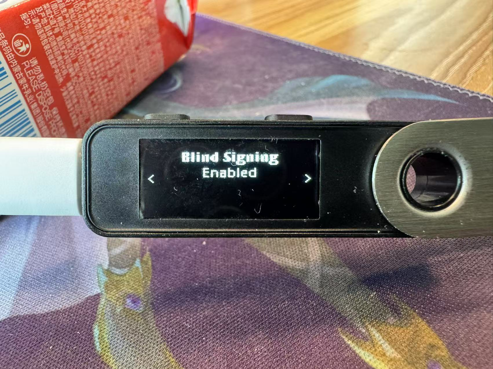

# How To Use Your Ledger Device With The Conflux Fluent Wallet

## Introduction

A Ledger Device is a hardware wallet that is considered one of the most secure ways to store your digital assets. Ledger uses an offline, or cold storage, method of generating private keys, making it a preferred method for many crypto users. This guide will help you to connect your Ledger device to the Conflux Fluent Wallet. The Conflux Fluent Wallet enables you to Send and Receive CFX and tokens issued on Conflux network.

## Quick Links

- Before You Start, Make Sure
- Video Guide
- Install The Conflux App
- Connecting to the Conflux Fluent Wallet
- View Account Balance
- Receiving CFX in the Conflux Fluent Wallet
- Sending CFX in the Conflux Fluent Wallet
- Support

## Before You Start, Make Sure

1. You’ve initialized your Ledger Device.
2. The latest firmware is installed (Ledger Nano S Plus).
3. Ledger Live is ready to use.
4. Install the latest version of [Conflux Fluent Wallet](https://fluentwallet.com/) (above 2.8.0)
    

## Video Guide

https://youtu.be/QaDE8k57dGQ

## Install The Conflux App

1. Open the Manager ("My Ledger") in Ledger Live.
2. Connect and unlock your Ledger Device.
3. If asked, follow the onscreen instructions and Allow Ledger Manager.
4. Find Conflux in the app catalog.
   
5. Click the Install button.
    1. An installation window will appear.
    2. Your device will display Processing…
    3. The app installation is confirmed.
    4. 
6. Close Ledger Live.

## Connecting to the Conflux Fluent Wallet

1. First, connect and unlock your Ledger Device.
2. Open the Conflux App on your Ledger Device 
    
3. Open the Conflux Fluent Wallet Application.
4. Open settings(top right) and choose the "Account Management" option.
   
5. Click the "Add Account" button.
    
6. Choose hardware wallet and make your hardware wallet ready.
    
    
7. Choose address and Click Import button
    
8. Success
    

## View Account Balance

Your account balance is shown on the asset list of the Fluent Wallet, including CFX and tokens issued on the Conflux network.

## Receiving CFX in the Conflux Fluent Wallet

You can get your Receive address by simply `copying the address to the clipboard` or by `scanning the QR Code`.

The copy icon and QR code icon are located on the right side of the address.

## Sending CFX in the Conflux Fluent Wallet

1. Click the `Send` button on the Fluent Wallet.
2. Fill in the recipient address, choose token to send and fill in amount to send.
    
3. Click the `Next` button. And confirm the transaction on your Ledger Device.
    
    
    
    
    
    
    
4. If everything is correct, in the `Approve` page, click both left and right buttons on your Ledger Device to confirm the transaction.
5. The transaction is now sent and you can view it in the transaction history.
   
   
6. If you are sending tokens, you need to enable the "Blind Signing" in the Ledger Device.
   
    Click both left and right buttons on your Ledger Device to enable the "Blind Signing".
   
7. A blind signing warning will appear when you send tokens.
   

## FAQs

1. Which Ledger Devices are supported?
    - Ledger Nano S Plux
    - Ledger Nano X
    - Ledger Flex
    - Ledger Stax
2. Which version of the Fluent Wallet is supported?
    - Fluent Wallet version 2.8.0 and above.

## Support

Emial: build@confluxnetwork.org

Github Issue: https://github.com/Conflux-Chain/app-conflux/issues